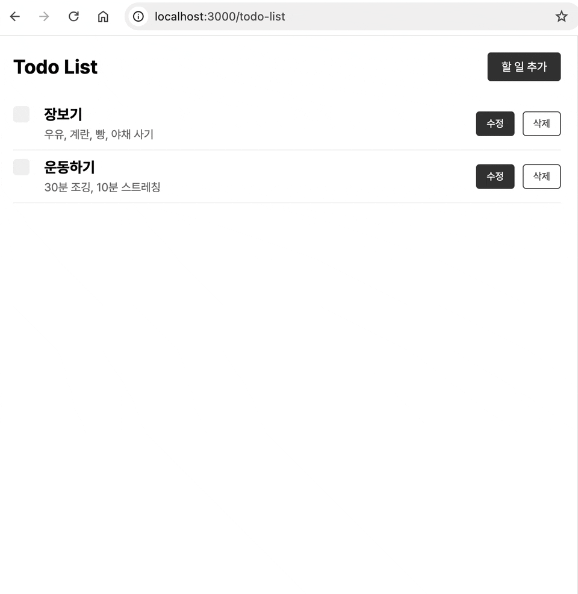
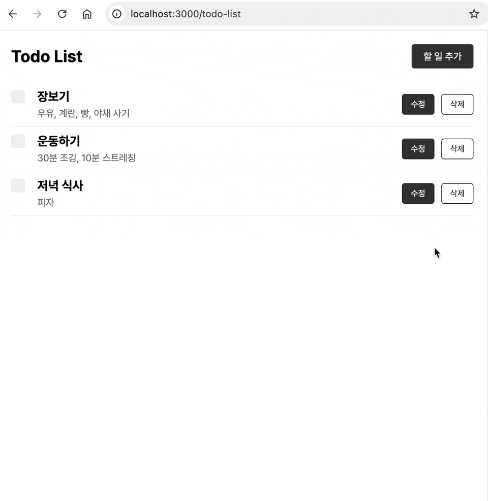
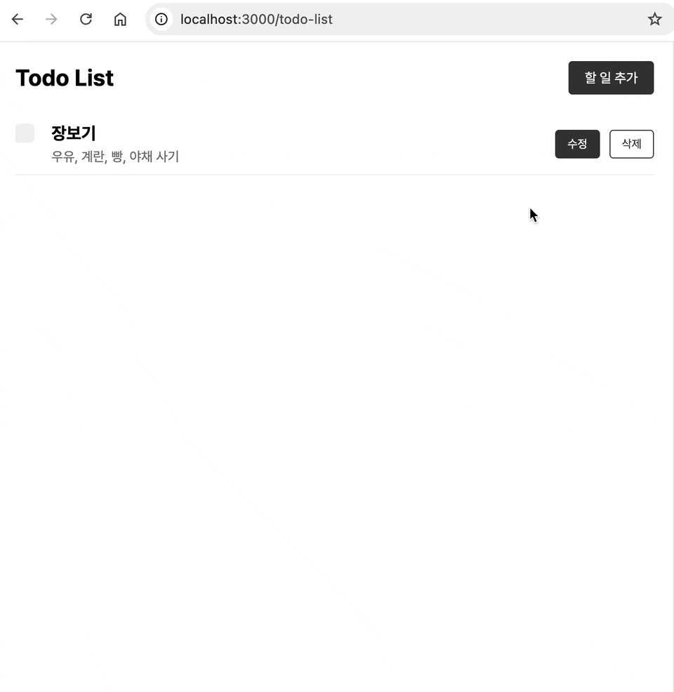
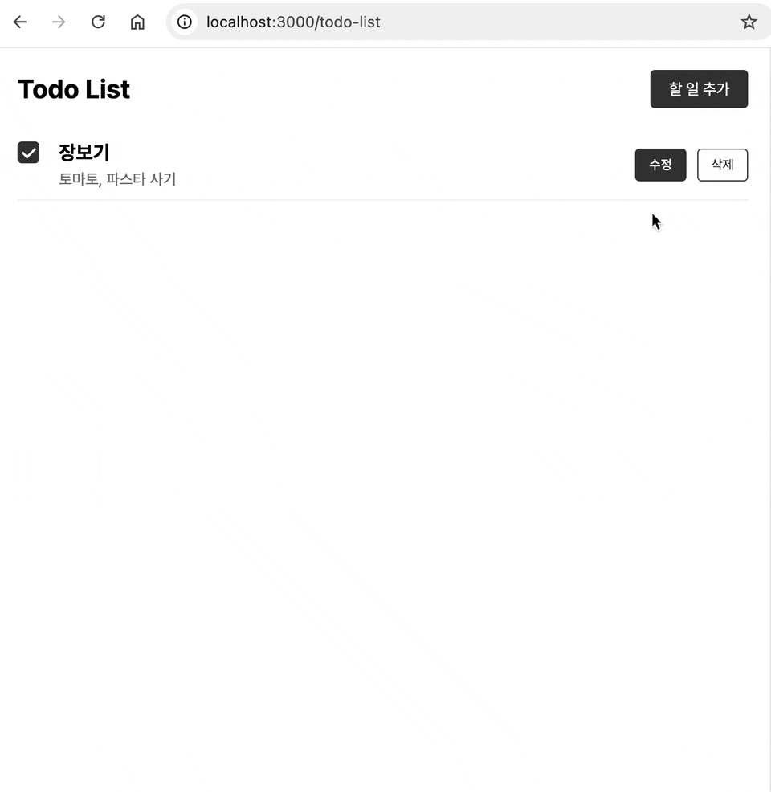
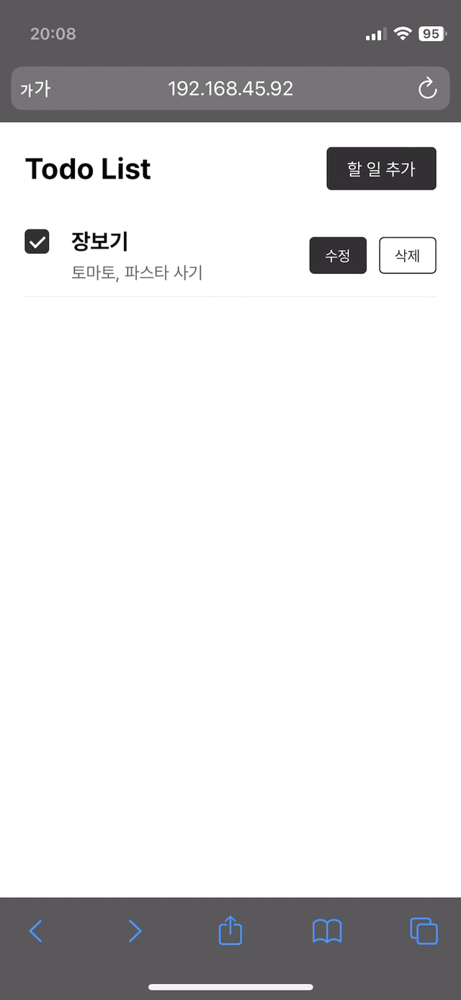
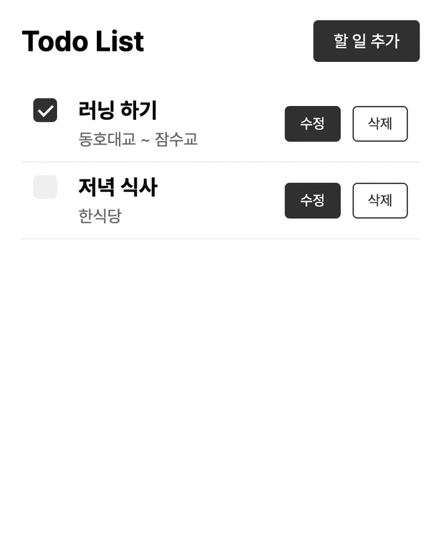
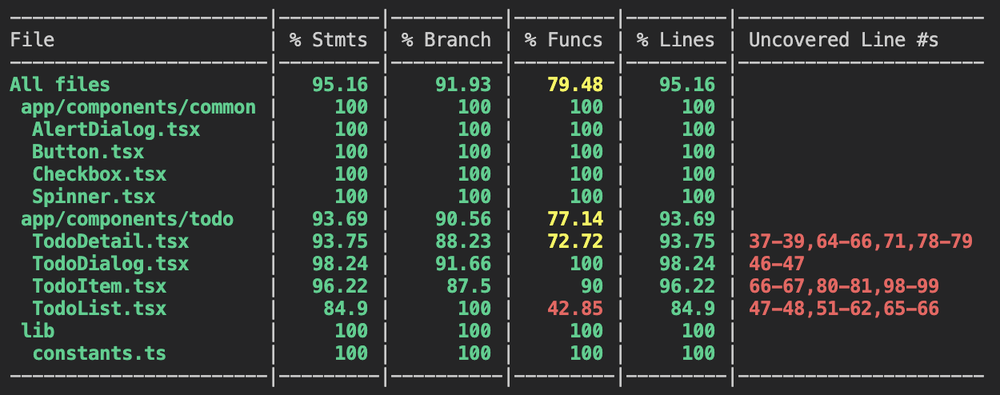

# ☑️ Todo List Project


## 목차

- [프로젝트 개요](#프로젝트-기획동기)
- [기술 스택](#기술-스택)
- [설치 및 실행 방법](#설치-및-실행-방법)
- [구현 기능](#구현-기능)
- [프로젝트 구조](#프로젝트-구조)
- [과제를 진행하며 고민한 부분들](#과제를-진행하며-고민한-부분들)
  - [서버 컴포넌트와 클라이언트 컴포넌트의 설계](#서버-컴포넌트와-클라이언트-컴포넌트의-설계)
  - [상태 관리 전략](#상태-관리-전략)
  - [서버 컴포넌트의 캐싱 문제](#서버-컴포넌트의-캐싱-문제)
  - [유닛 테스트를 통한 컴포넌트 동작 검증](#유닛-테스트를-통한-컴포넌트-동작-검증)
- [회고](#회고)

<br>

## 프로젝트 개요

에이티앤피파트너즈 비스킷팀의 프론트엔드 개발자 채용 과제로 제작된 Todo List 애플리케이션입니다. Next.js 14와 TypeScript를 사용하여 개발되었으며, 반응형 디자인을 적용하여 모바일과 데스크톱 환경에서 사용 가능합니다.

<br>

## 기술 스택

- Next.js 14 (App Router)
- TypeScript
- Module SCSS
- json-server

<br>

## 설치 및 실행 방법

1. 레포지토리를 클론합니다:
   ```
   git clone https://github.com/moonstrnck/front-assignment.git
   ```
2. 프로젝트 디렉토리로 이동합니다:
   ```
   cd front-assignment
   ```
3. 필요한 패키지를 설치합니다:
   ```
   npm install
   ```
4. json-server를 실행합니다:
   ```
   npm run server
   ```
5. 개발 서버를 실행합니다:
   ```
   npm run dev
   ```
6. 브라우저에서 `http://localhost:3000/todo-list`로 접속하여 애플리케이션을 확인합니다.

<br>

## 구현 기능

<table style="width: 100%; border-collapse: collapse;">
  <tr>
    <th style="width: 33.33%; text-align: center;">Todo 조회 및 생성</th>
    <th style="width: 33.33%; text-align: center;">Todo 수정</th>
    <th style="width: 33.33%; text-align: center;">Todo 삭제</th>
  </tr>
  <tr>
    <td style="text-align: center;"></td>
    <td style="text-align: center;"></td>
    <td style="text-align: center;"></td>
  </tr>
  <tr>
    <td>Todo 목록을 조회하고 새로운 Todo를 생성할 수 있습니다. 빈 값을 입력할 경우 알림 메시지가 표시됩니다.</td>
    <td>기존 Todo의 제목과 내용을 수정할 수 있습니다. 수정 중 변경 사항이 있을 경우, 페이지 이탈 시 알림 메시지가 표시됩니다.</td>
    <td>Todo를 삭제할 수 있습니다. 삭제 전 확인 대화상자가 표시되어 실수로 인한 삭제를 방지합니다.</td>
  </tr>
</table>
<table style="width: 100%; border-collapse: collapse;">
  <tr>
    <th style="width: 33.33%; text-align: center;">Todo 상세</th>
    <th style="width: 33.33%; text-align: center;">로딩 및 에러 처리</th>
    <th style="width: 33.33%; text-align: center;">모바일</th>
  </tr>
  <tr>
    <td style="text-align: center;"></td>
    <td style="text-align: center;"></td>
    <td style="text-align: center;"></td>
  </tr>
  <tr>
    <td>Todo 아이템을 클릭하면 Todo의 상세화면으로 진입합니다. Todo 수정 및 삭제가 가능합니다.</td>
    <td>비동기 작업에 대해 로딩 상태를 표시하며, 에러 발생 시(예: 서버 연결 오류) 사용자에게 적절한 피드백을 제공합니다.</td>
    <td>모바일부터 데스크톱까지 다양한 화면 크기에 최적화된 반응형 디자인을 제공합니다.</td>
  </tr>
</table>

- Server Side Fetching 및 Server Actions 활용
- 커스텀 Button 및 Checkbox 컴포넌트
- Dialog 및 Alert Dialog 구현 (Radix UI 사용)

<br>

## 프로젝트 구조

```
src/
│
├── app/
│   ├── components/
│   │   ├── common/
│   │   │   ├── AlertDialog
│   │   │   ├── Button
│   │   │   ├── Checkbox
│   │   │   └── Spinner
│   │   └── todo/
│   │       ├── TodoDetail
│   │       ├── TodoDialog
│   │       ├── TodoItem
│   │       └── TodoList
│   │
│   ├── fonts/
│   ├── styles/
│   │   ├── _mixins.scss
│   │   ├── _variables.scss
│   │   └── globals.scss
│   │
│   ├── todo-list/
│   │   └── [id]/
│   │
│   ├── error.tsx
│   ├── layout.tsx
│   ├── loading.tsx
│   └── page.tsx
│
└── lib/
    ├── actions.ts
    ├── api.ts
    └── constants.ts
```

<br>

## 과제를 진행하며 고민한 부분들

### 서버 컴포넌트와 클라이언트 컴포넌트의 설계
이번 프로젝트를 통해 Next.js의 App Router와 서버 컴포넌트, 클라이언트 컴포넌트의 개념을 처음 접하고 실제 애플리케이션에 적용해 보는 기회가 되었습니다. 초기에는 이 개념들이 생소했지만, 프로젝트를 진행하면서 각 컴포넌트 타입의 장단점과 적절한 사용 상황을 이해하게 되었습니다.

1. 서버 컴포넌트의 활용

    `todo-list/page.tsx`의 `TodoListPage`와 `todo-list/[id]/page.tsx`의 `TodoDetailPage`를 서버 컴포넌트로 구현했습니다.
    이 선택의 주된 이유는 이 컴포넌트들이 페이지의 진입점으로서 초기 데이터 로딩을 담당하기 때문입니다.
    서버에서 데이터를 미리 가져와 렌더링함으로써 페이지 로드 속도를 향상시키고, 초기 페이지 컨텐츠의 SEO를 개선할 수 있었습니다.


2. 클라이언트 컴포넌트의 전략적 사용

    `TodoList`, `TodoItem`, `TodoDialog` 등 사용자 상호작용이 많은 컴포넌트들은 클라이언트 컴포넌트로 구현했습니다.
    이는 `useState`, `useEffect` 같은 React 훅을 사용해야 하고, 동적인 UI 업데이트가 필요하기 때문입니다.
    클라이언트 컴포넌트임에도 불구하고, actions.ts에 정의된 서버 액션을 통해 데이터 변경을 처리하여 서버와의 효율적인 통신을 구현했습니다.


3. 데이터 흐름 최적화

    초기 데이터 로딩은 `api.ts`에 정의된 함수를 통해 서버 사이드에서 처리합니다.
    이후의 데이터 수정, 생성, 삭제 등의 작업은 `actions.ts`에 정의된 서버 액션을 통해 처리합니다.
    이러한 구조를 통해 초기 로딩은 빠르게, 그 이후의 상호작용은 실시간으로 반응하는 애플리케이션을 구현할 수 있었습니다.


### 상태 관리 전략

이 프로젝트에서는 **전역 상태 관리 도구를 사용하지 않고**, React의 기본적인 상태 관리 기능과 Next.js의 서버 액션을 조합하여 상태를 관리하기로 결정했습니다. 가장 큰 이유는 **데이터 흐름의 명확성을 유지하고자 했기 때문입니다.** <br>

서버 액션을 처음 사용해보는 상황에서, 전역 상태 관리까지 도입하면 데이터의 흐름을 추적하기 어려워질 수 있다고 생각했습니다. 그래서 컴포넌트 기반의 로컬 상태 관리를 통해 데이터의 흐름을 더 명확하게 파악하고 제어하고자 했습니다. <br>

또한 현재 Todo 리스트 애플리케이션의 규모와 복잡성을 고려할 때, 컴포넌트 기반의 상태 관리만으로도 충분히 효과적일 것으로 판단했습니다. `useState`와 `props`를 통해 클라이언트 측 상태 관리를 진행했으며, 서버 액션을 통해 조요 데이터 조작 로직을 처리했기 때문에 클라이언트 측 상태 관리의 복잡성을 줄일 수 있었습니다.


### 서버 컴포넌트의 캐싱 문제

<p align="center">
   <br>
  <i>Todo 상세에서 이전 데이터가 표시됨</i>
</p>

**문제점** <br>
디버깅 과정에서 Todo 아이템을 클릭하여 상세 페이지(TodoDetail)로 진입할 때, 가끔 **최신 데이터가 아닌 이전 데이터가 표시되는 문제**를 발견했습니다.


**문제 해결** <br>
결과적으로 이 문제가 Next.js의 기본 캐싱 동작 때문임을 발견했습니다. 해결책으로 `TodoDetailPage`에서 사용하는 서버 사이드 로직인 `getTodo` 함수에 `cache: 'no-store'` 옵션을 추가했습니다. 이 옵션은 매 요청마다 새로운 데이터를 서버에서 가져오도록 보장하여 문제를 해결했습니다.

**궁금점** <br>
문제는 해결했지만, 궁금증이 생겼습니다. 초기 화면인 `TodoListPage`(todo-list/page.tsx)도 서버 컴포넌트인데, 왜 이 컴포넌트는 캐싱 문제 없이 항상 최신 데이터를 잘 가져왔던 건지, 그 차이가 무엇인지 조사해보았습니다.

조사 결과, 저는 다음과 같은 사실을 알게 되었습니다.

1. 동적 라우트 vs 정적 라우트: `TodoListPage`는 정적 라우트(`/todo-list`)를 사용하는 반면, `TodoDetail`은 동적 라우트(`/todo-list/[id]`)를 사용합니다. Next.js는 동적 라우트에 대해 더 공격적인 캐싱을 적용할 수 있습니다.

2. 요청 빈도: 목록 페이지는 상대적으로 자주 접근되어 데이터가 자주 갱신되는 반면, 개별 Todo 상세 페이지는 덜 빈번하게 접근될 수 있습니다.

3. `revalidatePath`: `actions.ts`의 서버 액션에서 `revalidatePath('/todo-list')`를 호출하고 있어, 목록 페이지의 데이터가 자주 재검증됩니다.

이러한 문제 해결 과정을 통해 Next.js의 캐싱 전략과 서버 컴포넌트의 동작에 대해 더 깊이 이해할 수 있었습니다. 또한, 성능 최적화와 데이터 일관성 사이의 균형을 맞추는 것의 중요성을 깨달았습니다.


### 유닛 테스트를 통한 컴포넌트 동작 검증
컴포넌트에 대해 유닛 테스트를 실시하여 각 컴포넌트의 독립적인 동작을 검증하였습니다. 특히 다음과 같은 이점을 얻을 수 있었습니다.

1. 오류 처리 검증

    로딩 및 에러 처리 컴포넌트에 대한 테스트를 통해, 오류 상황을 시뮬레이션하고 적절한 에러 핸들링이 이루어지는지 확인했습니다. 사용자에게 적절히 오류를 안내하는 것은 서비스의 신뢰도를 높이는 데 기여한다고 생각합니다.

2. 컴포넌트 간 의존성 파악

    Todo 관련 컴포넌트를 테스트하는 과정에서 컴포넌트 간의 높은 의존성을 발견할 수 있었습니다. 예를 들어, 수정 기능의 경우 수정 버튼 클릭, Dialog 컴포넌트에서의 내용 수정, 확인 버튼 클릭, TodoList 업데이트 등 여러 컴포넌트가 연계되어 작동합니다. 이러한 전체적인 기능의 정확성을 검증하고 싶었지만, 이는 유닛 테스트의 범위를 벗어난다고 판단하여 보류하였습니다. 향후 통합 테스트의 필요성을 인식하게 된 기회였습니다.


<p align="center">
   <br>
  <i>테스트 커버리지</i>
</p>


## 회고

이번 과제를 통해 많은 성장을 이뤘다고 생각합니다. Next.js도 처음이었고 TypeScript는 개인 프로젝트 마이그레이션을 준비 중이긴 했으나 실제 애플리케이션 개발 경험은 없었습니다. 하지만 이번 기회를 통해 경험해볼 수 있어 행운이라 생각합니다. <br>
촉박한 일정이었지만 마음이 급할 수록 초반 설계가 무너지는 경험을 많이 했었고, 그 초반 설계가 전체 프로젝트에 큰 영향을 줄 수 있다는 점을 알고 있었기에 더욱 차분히 진행하고자 노력했습니다. <br>
덕분에 Next.js의 전반적인 개념을 습득할 수 있었습니다. 이 경험을 바탕으로 Next.js에 대해 더욱 더 흥미가 생기고 SSR 프로젝트를 더 진행해보고 싶다는 욕심도 생겼습니다. 앞으로 SSR에 대해 더 깊이있는 학습을 하여 SSR과 CSR의 차이와 이점을 명확히 알고, 대세가 아닌 필요에 의한 개발을 하는 개발자가 될 수 있도록 노력하겠습니다. 다시 한 번 과제를 진행할 수 있는 기회를 주셔서 감사합니다.
